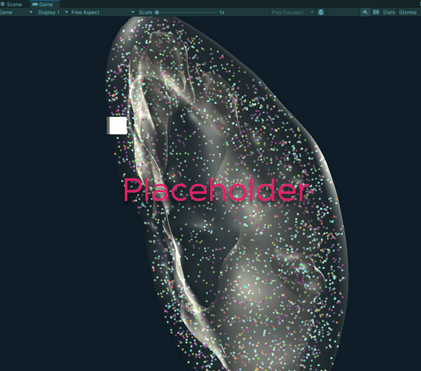

# **Companion Website for &quot;Constructing and Using Cell Type Populations for the Human Reference Atlas&quot;**

Andreas Bueckle1,4,\*\*, Bruce William Herr II1, Lu Chen2, Daniel Bolin1, Vicky Daiya1, Devin Wright1, Dan Qaurooni1, Kristin Ardlie3, Fusheng Wang2, Katy Börner1,\*

1 Department of Intelligent Systems Engineering, Luddy School of Informatics, Computing, and Engineering, Indiana University, Bloomington, IN 47408, USA \
2 Department of Computer Science and Department of Biomedical Informatics, Stony Brook University, Stony Brook, 11794, NY, USA \
3 Broad Institute, Cambridge, 02142, MA, USA \
4 Lead contact \
\* Correspondence:  katy@indiana.edu, X: https://twitter.com/katycns \
\*\* Correspondence: abueckle@iu.edu, X: https://twitter.com/AndreasBueckle  

---

Link to paper on bioRxiv (forthcoming) \
[Link to hra-pop GitHub repository](https://github.com/x-atlas-consortia/hra-pop/tree/main/) \
[Link to HRApop graph data on HRA LOD server](https://cdn.humanatlas.io/digital-objects/graph/hra-pop/latest/) \
[Link to Atlas Enriched Dataset Graph](https://cdn.humanatlas.io/digital-objects/graph/hra-pop/v0.10.1/assets/atlas-enriched-dataset-graph.jsonld) \
[Link to Anatomical Structures (AS) Cell Summaries](https://cdn.humanatlas.io/digital-objects/graph/hra-pop/v0.10.1/assets/atlas-as-cell-summaries.jsonld)
[Link to HuBMAP Portal](https://portal.hubmapconsortium.org/) \
[Link to CZ CELLxGENE Portal](https://cellxgene.cziscience.com/) \
[Link to GTEx Portal](https://gtexportal.org/home/) \
[Link to SenNet Portal](https://data.sennetconsortium.org/) \
[Link to HRA Workflows Runner](https://github.com/hubmapconsortium/hra-workflows-runner/) \
[Link to HRA Workflows](https://github.com/hubmapconsortium/hra-workflows/tree/main)

# HRApop Extraction Sites
Assigning a spatial location via the Registration User Interface (RUI, [https://apps.humanatlas.io/rui](https://apps.humanatlas.io/rui/)) is an essential requirement for a dataset to be included in HRApop. Below is an instance of the Exploration User Interface (EUI, see federated version with all registered tissue blocks [here](https://apps.humanatlas.io/eui/)) that only shows extraction sites for datasets in HRApop.  

# Exemplary 3D visualization of cell type populations for 4 anatomical structures in the VH female, left Kidney (forthcoming)

This 3D visualization shows 50 unique cell types but only 0.01% of all the cells (3,310 out of 331,010) found in these anatomical structures based on experimental data registered into them (for performance reasons). A 5x5x5 mm tissue block is shown for scale. Please click and drag your left mouse button to rotate the camera around the kidney; click drag the right mouse button to pan; use the mouse scroll wheel to zoom in and out.

Code to demonstrate how 3D cells can be generated with Python is available [here](https://github.com/cns-iu/hra-cell-type-populations-supporting-information/blob/main/3d_cells_in_anatomical_structures/3d_cells_in_anatomical_structures.ipynb).

**This will be replaced with an interactive Unity web build.** 

# Bar graphs for cell type populations

Shown here are bar graphs for the cell type populations of the four anatomical structures shown in the kidney above (VH female, left) specifically for the cortex and three renal pyramids, based on collision detection results from eight tissue blocks. Visualized are 331,010 cells of 50 unique types. Note that the y-axis is scaled logarithmically to account for the vast ranges in numbers of cells per cell types.

**This will be replaced with updated bar graphs.** 

# Single-cell proteomics data

For HRApop v.10.1, the HRA Workflows Runner handled the download, annotation, and summary of single cell (sc-)transcriptomics datasets; cell summaries for sc-proteomics datasets were compiled on Github at [https://github.com/cns-iu/hra-ct-summaries-mx-spatial-data/tree/main](https://github.com/cns-iu/hra-ct-summaries-mx-spatial-data/tree/main). The HRApop Construction and Enrichment Pipeline gathered cell summaries for these datasets from there. Each dataset features a cell type for each cell but also individual coordinates. 
