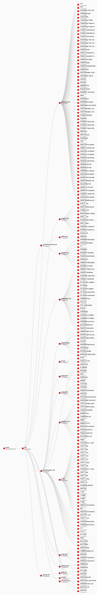
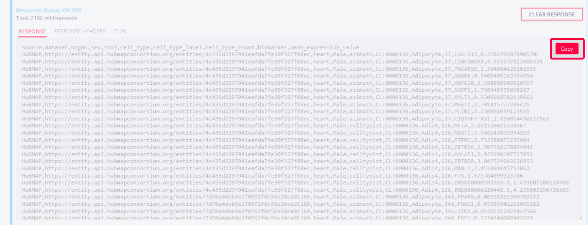
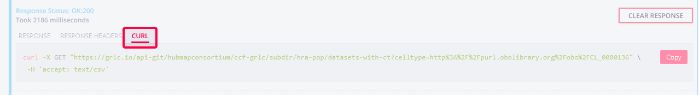

# **Companion Website for "Constructing and Using Cell Type Populations of the Human Reference Atlas"**

Andreas Bueckle<sup>1</sup>\*, Bruce William Herr II<sup>1</sup>\*, Lu Chen<sup>2</sup>, Daniel Bolin<sup>1</sup>, Danial Qaurooni<sup>1</sup>, Michael Ginda<sup>1</sup>, , Kristin Ardlie<sup>3</sup>, Fusheng Wang<sup>2</sup>, Katy Börner<sup>1</sup>\*

<sup>1</sup> Department of Intelligent Systems Engineering, Luddy School of Informatics, Computing, and Engineering, Indiana University, Bloomington, IN 47408, USA \
<sup>2</sup> Department of Computer Science and Department of Biomedical Informatics, Stony Brook University, Stony Brook, 11794, NY, USA \
<sup>3</sup> Broad Institute, Cambridge, 02142, MA, USA \
\* Corresponding authors\
[abueckle@iu.edu](mailto:abueckle@iu.edu)\
[bherr@iu.edu](mailto:bherr@iu.edu)\
[katy@iu.edu](katy@iu.edu)


---

# Links
## General
- Link to paper on bioRxiv (forthcoming)
- [Link to GitHub repository for Supporting Information](https://github.com/cns-iu/hra-cell-type-populations-supporting-information)
- [Link to HRA Portal](https://humanatlas.io/)

## Portals
- [Link to HuBMAP Portal](https://portal.hubmapconsortium.org/)
- [Link to SenNet Portal](https://data.sennetconsortium.org/)
- [Link to GTEx Portal](https://gtexportal.org/home/)
- [Link to CZ CELLxGENE Portal](https://cellxgene.cziscience.com/)

## Code
- [Link to HRA Workflows](https://github.com/hubmapconsortium/hra-workflows/tree/main)
- [Link to HRA Workflows Runner](https://github.com/hubmapconsortium/hra-workflows-runner/)
- [Link to HRApop GitHub repository](https://github.com/x-atlas-consortia/hra-pop/tree/main/)

## Data
- [Link to HRApop graph data on HRA LOD server](https://cdn.humanatlas.io/digital-objects/graph/hra-pop/latest/)

# Interactive Sankey Diagrams

In total, as of HRApop v0.11.1, there are 11,817 datasets in the HRApop Universe (107 of which are sc-proteomics), and they cover 27 organs. 619 datasets make up the HRApop Atlas. 3680 datasets have an extraction site but no cell summary. Inversely, 5075 datasets have a cell summary but no extraction site. 2324 datasets have neither. The total number of non-atlas datasets is 11,198. The Sankey diagrams below offer an overview of HRApop Universe and Atlas provenance. 

Explore the Sankey diagram for the HRApop Universe below (embedded) or [here](https://cns-iu.github.io/hra-cell-type-populations-supporting-information/sankey_universe_plotly.html).
<iframe 
src="https://cns-iu.github.io/hra-cell-type-populations-supporting-information/sankey_universe_plotly.html" 
title="Sankey HRApop Universe"
  width="100%"
  height="800"
    frameborder="0" 
    allowfullscreen>
</iframe>

Explore the Sankey diagram for the HRApop Universe below (embedded) or [here](https://cns-iu.github.io/hra-cell-type-populations-supporting-information/sankey_atlas_plotly.html).
<iframe 
src="https://cns-iu.github.io/hra-cell-type-populations-supporting-information/sankey_atlas_plotly.html" 
title="Sankey HRApop Atlas"
  width="100%" 
  height="800"
    frameborder="0" 
    allowfullscreen>
</iframe>

# HRApop Universe Extraction Sites
Assigning a spatial location via the Registration User Interface (RUI, [https://apps.humanatlas.io/rui](https://apps.humanatlas.io/rui/)) is an essential requirement for a dataset to be included in HRApop. Below is an instance of the Exploration User Interface (EUI, see federated version with all registered tissue blocks [here](https://apps.humanatlas.io/eui/)) that only shows extraction sites for datasets in the HRApop Universe.  

**Note: This will be replaced with a version showing extraction sites for the HRApop Atlas only.**

<a target="_blank" href="https://cns-iu.github.io/hra-cell-type-populations-supporting-information/"></a>

<a target="_blank" href="https://cns-iu.github.io/hra-cell-type-populations-supporting-information/"></a>

<iframe src="https://cns-iu.github.io/hra-cell-type-populations-supporting-information/eui.html" title="EUI for HRApop" width = "75%" height ="100%">
</iframe>

# z-scores for CTs per organ and AS
- High-resolution versions of the heatmaps are available [here](https://github.com/cns-iu/hra-cell-type-populations-supporting-information/tree/main/validations/heatmaps/figs). 
- The code to generate these heatmaps (exported to HTML) is [here](https://cns-iu.github.io/hra-cell-type-populations-supporting-information/HRA_HeatmapAnalysis_CellTypePer_v0.4.html). 
- The R Markdown notebook is [here](https://github.com/cns-iu/hra-cell-type-populations-supporting-information/blob/main/validations/heatmaps/HRA_HeatmapAnalysis_CellTypePer_v0.4.Rmd).

# CTann Tree


# Step-by-step Instructions
**Goal: get Mean B Expressions for a given CT in HRApop Atlas Datasets**

1. When opening [https://apps.humanatlas.io/api/grlc/hra-pop.html#get-/datasets-with-ct](https://apps.humanatlas.io/api/grlc/hra-pop.html#get-/datasets-with-ct), the first item shown is the SPARQL query running when the endpoint is called:


2. Below, you can specify your request. The only mandatory field is the `celltype`, which must be a Persistent URL (PURL). You can click the FILL EXAMPLE button to prefill this field with `http://purl.obolibrary.org/obo/CL_0000136`, which is `adipocyte`. Clickt the TRY button to run the query. 


3. Then, the response area presents the result of the query, which consists of a table with one CT-B record per row. You may copy the results to your clipboard with the COPY button. 


4. You can also click the tabs in the response area to get the `CURL` command to run the query for the same results:


# Exemplary Cell Summaries

## For a Dataset

Shown is a snippet from a cell summary for a dataset in the small intestine. For clarity, we only show four CTs in this cell summary, all assigned by CellTypist, and we only show the top 1- Bs for the last CT (`Tuft`).

```json
  {
        "@id": "https://entity.api.hubmapconsortium.org/entities/1628b6f7eb615862322d6274a6bc9fa0",
      "@type": "Donor",
      "samples": [
        {
          "@id": "https://entity.api.hubmapconsortium.org/entities/0b43d8d0dbbc5e3923a8b963650ab8e3",
          "@type": "Sample",
          "datasets": [],
          "sections": [
            {
              "@id": "https://entity.api.hubmapconsortium.org/entities/35e16f13caab262f446836f63cf4ad42",
              "@type": "Sample",
              "datasets": [
                {
                  "@id": "https://entity.api.hubmapconsortium.org/entities/3de525fe3e5718f297e8d62e037a042d",
                  "@type": "Dataset",
                  "link": "https://portal.hubmapconsortium.org/browse/dataset/3de525fe3e5718f297e8d62e037a042d",
                  "technology": "RNAseq",
                  "cell_count": "6000",
                  "gene_count": "60286",
                  "organ_id": "http://purl.obolibrary.org/obo/UBERON_0002108",
                  "label": "Registered 11/3/2023, HuBMAP Process, TMC-Stanford",
                  "description": "Dataset Type: RNAseq [Salmon]",
                  "thumbnail": "assets/icons/ico-unknown.svg",
                  "summaries": [
                    {
                      "@type": "CellSummary",
                      "annotation_method": "celltypist",
                      "modality": "sc_transcriptomics",
                      "summary": [
                        {
                          "cell_id": "ASCTB-TEMP:enterocyte",
                          "cell_label": "Enterocyte",
                          "gene_expr": [
                           ...
                          ],
                          "count": 3600,
                          "@type": "CellSummaryRow",
                          "percentage": 0.6
                        },
                        {
                          "cell_id": "ASCTB-TEMP:paneth",
                          "cell_label": "Paneth",
                          "gene_expr": [
                            ...
                            ],
                          "count": 265,
                          "@type": "CellSummaryRow",
                          "percentage": 0.04416666666666667
                        },
                        {
                          "cell_id": "ASCTB-TEMP:cycling-b-cell",
                          "cell_label": "Cycling B cell",
                          "gene_expr": [
                          ...
                          ],
                          "count": 43,
                          "@type": "CellSummaryRow",
                          "percentage": 0.007166666666666667
                        },
                        {
                          "cell_id": "ASCTB-TEMP:tuft",
                          "cell_label": "Tuft",
                          "gene_expr": [
                            {
                              "gene_id": "HGNC:29349",
                              "gene_label": "CCSER1",
                              "ensembl_id": "ENSG00000184305.15",
                              "mean_gene_expr_value": 3.573841094970703
                            },
                            {
                              "gene_id": "HGNC:18695",
                              "gene_label": "ST18",
                              "ensembl_id": "ENSG00000147488.11",
                              "mean_gene_expr_value": 2.0579261779785156
                            },
                            {
                              "gene_id": "HGNC:4036",
                              "gene_label": "FYB1",
                              "ensembl_id": "ENSG00000082074.18",
                              "mean_gene_expr_value": 2.106393337249756
                            },
                            {
                              "gene_id": "HGNC:10471",
                              "gene_label": "RUNX1",
                              "ensembl_id": "ENSG00000159216.19",
                              "mean_gene_expr_value": 2.0352487564086914
                            },
                            {
                              "gene_id": "HGNC:8783",
                              "gene_label": "PDE4D",
                              "ensembl_id": "ENSG00000113448.19",
                              "mean_gene_expr_value": 3.152188539505005
                            },
                            {
                              "gene_id": "HGNC:1079",
                              "gene_label": "BMX",
                              "ensembl_id": "ENSG00000102010.15",
                              "mean_gene_expr_value": 1.6486668586730957
                            },
                            {
                              "gene_id": "HGNC:13726",
                              "gene_label": "KMT2C",
                              "ensembl_id": "ENSG00000055609.19",
                              "mean_gene_expr_value": 2.2729785442352295
                            },
                            {
                              "gene_id": "HGNC:9066",
                              "gene_label": "PLCG2",
                              "ensembl_id": "ENSG00000197943.10",
                              "mean_gene_expr_value": 2.123337507247925
                            },
                            {
                              "gene_id": "HGNC:27363",
                              "gene_label": "ITPRID1",
                              "ensembl_id": "ENSG00000180347.13",
                              "mean_gene_expr_value": 1.7490202188491821
                            },
                            {
                              "gene_id": "HGNC:17890",
                              "gene_label": "HPGDS",
                              "ensembl_id": "ENSG00000163106.11",
                              "mean_gene_expr_value": 1.5961321592330933
                            }
                          ],
                          "count": 41,
                          "@type": "CellSummaryRow",
                          "percentage": 0.006833333333333334
                        }
	}
```

## For an AS

Shown is a snippet from the AS Cell Summary of the cortex of kidney, assgined by Azimuth. 

```json
  {
      "@type": "CellSummary",
      "sex": "Female",
      "cell_source": "http://purl.obolibrary.org/obo/UBERON_0002189",
      "cell_source_label": "outer cortex of kidney",
      "annotation_method": "azimuth",
      "aggregated_summary_count": 37,
      "aggregated_summaries": [
        {
          "aggregated_cell_source": "https://entity.api.hubmapconsortium.org/entities/367fee3b40cba682063289505b922be1",
          "percentage": 0.981
        },
        {
          "aggregated_cell_source": "https://entity.api.hubmapconsortium.org/entities/434fbc55d458dc4e06da9ba4961f3840",
          "percentage": 0.343
        },
        ...],
      "modality": "sc_transcriptomics",
      "summary": [
        {
          "@type": "CellSummaryRow",
          "cell_id": "CL:1000692",
          "cell_label": "Fibroblast",
          "count": 10336.100000000002,
          "percentage": 0.01925307293655101
        },
        {
          "@type": "CellSummaryRow",
          "cell_id": "CL:1001108",
          "cell_label": "Medullary Thick Ascending Limb",
          "count": 26758.349000000002,
          "percentage": 0.04984282707778434
        },
        {
          "@type": "CellSummaryRow",
          "cell_id": "CL:4030013",
          "cell_label": "Descending Thin Limb Type 2",
          "count": 31925.262000000002,
          "percentage": 0.05946724565401847
        }
        ...
	}
```